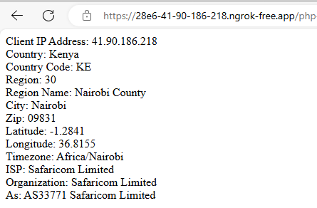

# GeoLocation API consumed using PHP Language
Function to determine the user location using IP address via 'https://ip-api.com/' API using PHP Language.

# How To Run
1. Clone this repo to you compute and copy it to the www/htdocs diectory
2. Navigae to the folder via browser
3. you will the the location data of the current user
4. Enjoy, Star, Like :-D

# Credits
1. [https://ip-api.com/](https://ip-api.com/) for providing the Free GeoLocation API. Read the official docs [Here](https://ip-api.com/docs/api:json).
